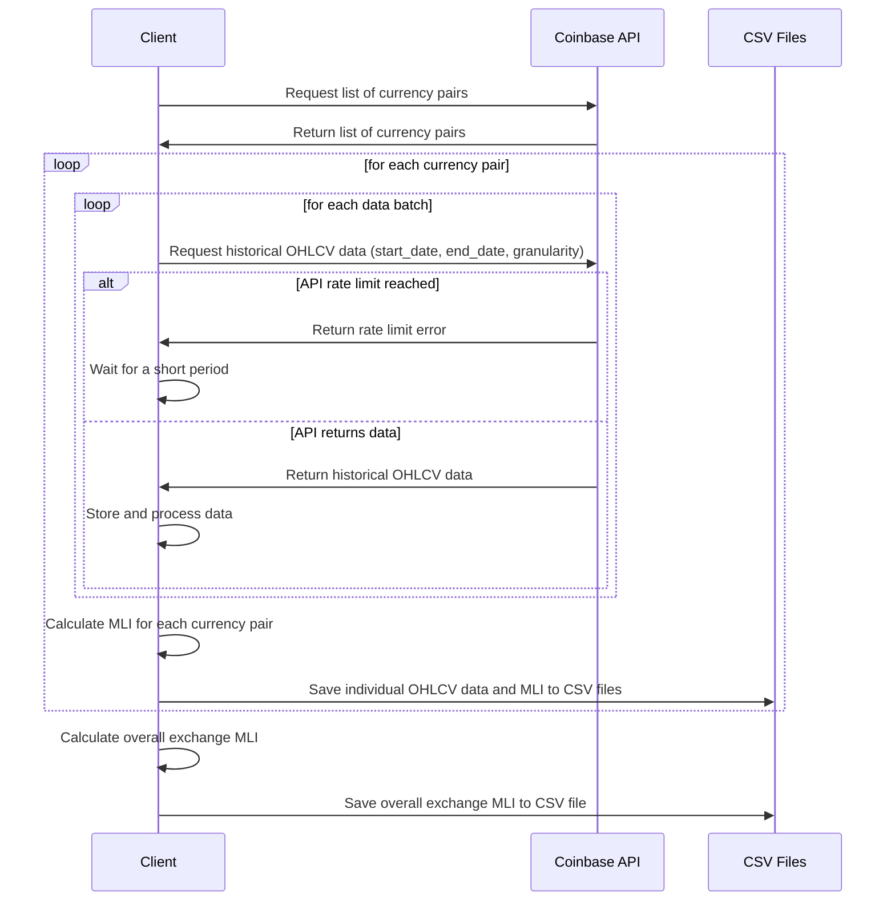

# Cryptodata_Coinbase_Kraken_Binance

This repository downloads the historical data from Coinbase, Binance, and Kraken. It provides an efficient solution for downloading historical cryptocurrency data from multiple exchanges, addressing the issue of API limitations and rate limits. The Coinbase API only supports 300 records per request. We harvest the data incrementally in batches of 299 days to ensure we don't exceed the API limits. By implementing an incremental approach, the project ensures comprehensive data retrieval, allowing users to access historical OHLCV data for in-depth analysis and research.

## Features

- Download historical OHLCV (Open, High, Low, Close, Volume) data from Coinbase, Binance, and Kraken
- Batch the requests to retrieve data incrementally, working within the API limitations
- Handle API rate limit errors by waiting for a short period before retrying the request
- Save the downloaded data as CSV files for further analysis or processing
- Calculate the Market Liquidity Index (MLI) for each currency pair
- Calculate the overall exchange MLI weighted with traded volume

## Sequence Diagram

## Usage

1. Clone the repository or download the source code.
2. Modify the download scripts for each exchange as needed (e.g., specify the date range, currency pairs, or output folder).
3. Run the download scripts for each exchange to fetch the historical data and save it as CSV files.
4. Analyze the downloaded data, perform calculations, or use the data for your own research or trading strategies.

## Note

Please be aware of the rate limits imposed by each exchange's API. Ensure that you do not exceed the rate limits, as this may lead to temporary or permanent bans. It's always a good practice to add delays between requests and handle API errors gracefully.

## Disclaimer

This project is for educational purposes only. It is not intended to be used for financial or investment advice. Use the data and scripts at your own risk. The authors are not responsible for any loss or damages incurred as a result of using this project.
